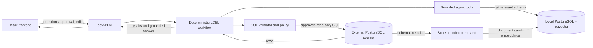

# System Overview

The external source database is used for both schema introspection and read-only
business-query execution. The local index stores technical schema metadata,
semantic metadata, documents, and embeddings only. Generated business SQL never
targets the local index.

The model proposes structured outputs inside the bounded workflow. FastAPI,
deterministic validation, approval gates, resource limits, and the source
database's read-only role remain the authorization boundary.
